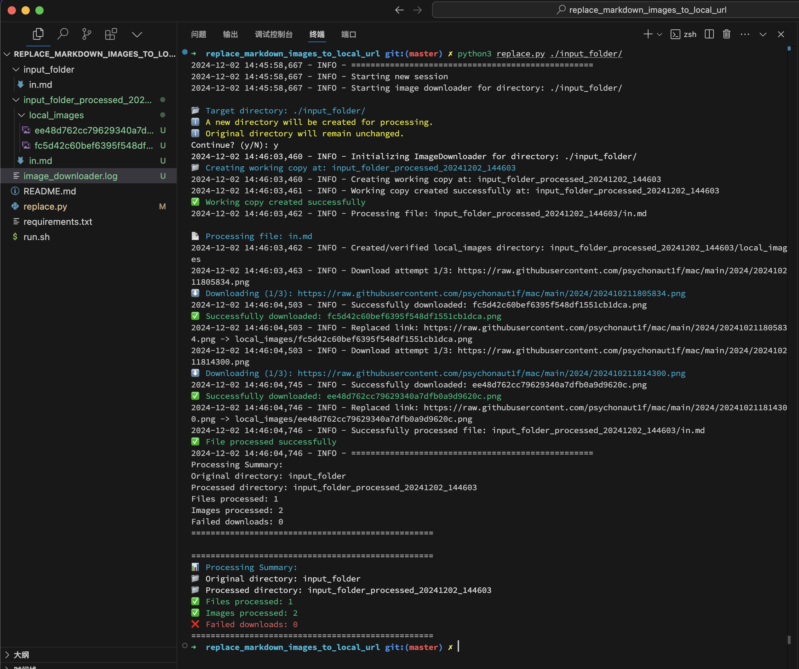

# Markdown Image URL Localizer

A tool to download remote images and replace their URLs with local paths in Markdown files, perfect for note backup and offline access.



## 📝 Description

This tool helps you create self-contained local copies of your Markdown notes by:
- Automatically downloading all remote images referenced in your Markdown files
- Converting remote image URLs to local file paths
- Creating a complete offline backup of your notes with all images
- Preserving the original Markdown structure and formatting

Perfect for:
- Creating offline backups of your notes
- Archiving blog posts or documentation
- Ensuring long-term accessibility of your content
- Preventing broken image links due to remote changes

> ⚠️ **Important**: Always create a backup of your Markdown files before running this tool!

## 🚀 Installation

1. Clone this repository:

```bash
git clone [repository-url]
cd markdown-image-localizer
```

2. Install dependencies:

```bash
pip3 install -r requirements.txt
```

## 💻 Usage

```bash
python3 replace.py <folder_path>
```

Where:
- `folder_path`: Path to the folder containing Markdown files to process

Example:

```bash
python3 replace.py ./my_markdown_files
```

## 🤝 Contributing

Contributions are welcome! Please feel free to submit a Pull Request.
